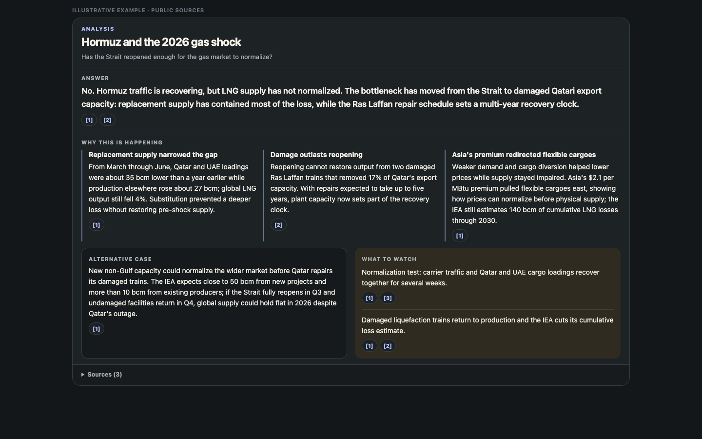

# Driftglass

**Keep a current answer to questions that outlive the news cycle.** Driftglass follows the sources you choose, consolidates repeated coverage, and maintains a cited answer with the causes, strongest alternative case, and signals that would change it.



See a standing question move from new sources to a saved answer: [Quick walkthrough](docs/assets/launch/walkthrough.mp4).

## Quick start

### 1. Install on Cloudflare

Activate R2 in the target Cloudflare account, then install Git and Node.js 22 or newer:

```bash
git clone https://github.com/anotb/driftglass.git
cd driftglass
npm install
npx wrangler login
cp .deploy-secrets.example .deploy-secrets
# Replace the placeholder with the output of: openssl rand -hex 32
npm run check:deploy
npm run deploy:first
```

This creates the Worker resources, applies D1 migrations, and sets 30-day expiry for disposable `raw/` captures. Email Routing, AI Search, the Companion, and Workers Paid are optional. See [Deployment](docs/DEPLOY.md) for costs, staging, and later upgrades.

### 2. Run the experimental local preview

The source-checkout preview requires Git and Node.js 24.4 or newer:

```bash
git clone https://github.com/anotb/driftglass.git
cd driftglass
npm install
npm run selfhost:build
node dist/selfhost/driftglass-selfhost.mjs init --data-dir "$PWD/.local-driftglass"
node dist/selfhost/driftglass-selfhost.mjs serve --data-dir "$PWD/.local-driftglass"
```

This starts a loopback-only instance with local SQLite and filesystem storage. It is not yet a packaged desktop or server release. See [Portable Runtime](docs/PORTABLE-RUNTIME.md) for backups, restore, and current limits.

### 3. Connect an agent or reasoning model

After Driftglass is running, open **Reasoning** in the dashboard.

- **ChatGPT:** choose **Connect ChatGPT**, complete the connection, then select Driftglass from **Tools** in a new Work chat. The optional `@Driftglass` plugin gives steadier Today and Mission routing.
- **Claude:** add the compact remote MCP, or use the generated Agent Skill and Markdown/JSON context.
- **Other agents:** connect the read-only MCP at `/mcp`. Machine-readable discovery lives at `/llms.txt`, `/llms-full.txt`, `/.well-known/mcp.json`, `/.well-known/driftglass.json`, and `/openapi.json` on the running instance.

Add the separate **Allow updates** connection only when the agent should save answers or suggestions for your review.

WebMCP remains experimental. It needs Chrome 149 or newer, an origin-trial token for the deployed origin or `chrome://flags/#enable-webmcp-testing` locally, and an open, unlocked Driftglass dashboard tab. The compact remote MCP works without WebMCP.

## First useful session

1. Open the dashboard with the owner secret and run the setup check.
2. Keep the Free usage profile and install one featured Intelligence Pack.
3. Collect once. Driftglass groups repeats into Stories and matches them to the Pack's Research Missions.
4. Open **Today** and choose a Mission with a question you care about.
5. Connect your reasoning model and ask for the current answer, what changed, and what would change it again.
6. Save the cited answer if it is worth carrying into the next update.

That is the product loop. The Companion, AI Search, Email Routing, and Computer Power Mode can wait until a Mission needs them.

## What Driftglass keeps for each question

A Research Mission holds:

- the question and current answer
- the sources and developing Stories behind it
- chronology, disagreements, and missing information
- the next event or measurement worth watching
- earlier answers, decisions, forecasts, and outcomes

Missions can cover energy flows through Hormuz, AI entering the experimental science cycle, a market thesis, a policy change, or a technical dependency. They are standing questions, not feed categories.

```text
chosen sources → collected items → developing Stories → Research Mission
                                                           ↓
Today ← cited current answer ← chosen reasoning model ← prepared context
  ↓                                                        ↑
what changed → next event → scheduled refresh → connected memory
```

Quiet days do not need a briefing.

## Sources and answers

Ten articles repeating one announcement are still one line of reporting. Driftglass groups sources by publisher, repository, package, author, community, and declared family, then marks their relationship to a Story:

```text
origin · independent · same-family · update · echo
```

The context sent to a model favors original reporting and independent support while retaining useful updates. It can include the Mission question, source links, relevant memory, disagreements, open questions, and the requested answer shape.

The returned answer keeps its citations, model label, confidence, and source-state hash. A second model can answer from the same source state for comparison. Suggested memory changes stay pending until approved.

Driftglass does not require an OpenAI, Anthropic, or xAI model API key. It uses compatible subscription clients through MCP or portable context files.

## What ships

- **Today:** a finite briefing of changed Missions and Stories.
- **Research Missions:** standing questions with a current answer, next event, and history.
- **Connected memory:** bounded links among sources, claims, findings, questions, decisions, and forecasts.
- **Intelligence Packs:** reusable sources, Missions, starter memory, standards, and scheduled research for a domain.
- **Mission Computers:** one working directory per Mission for its current source snapshot, notes, results, and exports.
- **Sharing:** cited web pages, downloadable copies, and credential-free Packs for following the same public question.
- **Budget Governor:** limits collection, rendering, storage, and scheduled work to the selected usage profile.

The default MCP is compact and read-only. Its operations counterpart uses an independently derived capability and handles saved results, outcomes, Pack changes, workspace notes, and approved memory changes.

## Sources

The cloud core supports Hacker News, Lobsters, Bluesky, arXiv, GitHub Releases and Activity, npm, PyPI, public webpages, Page Feeds, Email Workers intake, and manual capture. OpenAlex uses an optional account key.

The optional Companion adds signed-in sources and mirrors Mission workspaces to macOS, Windows, or Linux. Browser sessions stay on that machine. Public collection and Mission state continue without it.

## Architecture in one minute

| Layer | Role |
|---|---|
| Workers | API, dashboard, routing, MCP, and static assets |
| D1 | Stories, Missions, memory, decisions, budgets, and run state |
| R2 | source bodies, reasoning inputs, results, exports, and previews |
| Queues and Workflows | bounded ingestion, recovery, Mission refresh, and research routines |
| Kitesurf, then Chromium | rendered public pages |
| Cloudflare Computer | one filesystem per Mission |
| Drop | portable answers and Intelligence Packs |

The Cloudflare profile is the 0.9.0 release path. The local SQLite profile is experimental. Deployment provisions a dedicated per-environment OAuth KV namespace. AI Search is setup-gated, and retained Workers traces are disabled.

Architecture details: [Product Boundary](docs/PRODUCT-BOUNDARY.md) · [Runtime Fabric](docs/RUNTIME-FABRIC.md) · [Reasoning Interfaces](docs/REASONING-INTERFACES.md) · [Memory Graph](docs/MEMORY-GRAPH.md) · [Mission Computer](docs/COMPUTER.md) · [Intelligence Packs](docs/INTELLIGENCE-PACKS.md) · [Budget Governor](docs/BUDGET-GOVERNOR.md)

## Docs

- [0.9.0 release notes](docs/RELEASE-0.9.0.md)
- [Install guide](public/install.md)
- [Validation](docs/VALIDATION.md)
- [Roadmap](docs/ROADMAP.md)
- [Security](SECURITY.md)

## License

Apache-2.0. Integrated upstream tools remain separately installed under their own licenses.
