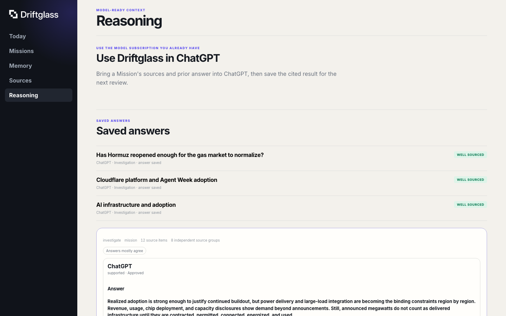

# Driftglass 0.9.0

Version 0.9 connects continuous monitoring to a current answer. A Research Mission can now carry its conclusion, causal judgments, strongest alternative case, signals to watch, citations, decisions, forecasts, and earlier states.

The answer can appear in Today, return through MCP, stay with the Mission, and be published as a source-linked page or portable Drop.

## Standing questions and current answers

Mission briefs now bring together:

- the question and current thesis
- a chronology of material changes
- original reporting, independent support, updates, and repeated coverage
- contradictions and missing information
- the next event or measurement to watch
- linked decisions, forecasts, outcomes, and earlier answers

The brief is compiled from saved state. The connected model does the interpretation, and Driftglass saves the cited answer with the source state that produced it.

## Reasoning through the model you use

ChatGPT, Claude, Grok, or another compatible client can read the same prepared source state. Driftglass records the model label, answer hash, citations, confidence, and review outcome against an immutable Evidence-State Receipt.

Several models can answer from one receipt. Comparison shows where their conclusions, confidence, and cited support differ. A model can suggest a memory change, but the proposal remains separate from saved memory until approved.

The default MCP remains compact and read-only. A separately connected operations profile handles saved answers, decisions, Mission runs, Pack changes, Computer notes, and approved memory proposals. The two connections use independent capability keys.

## Sources with lineage

Items from the same underlying announcement no longer count as independent support simply because several sites repeated it. Driftglass groups source families by publisher, repository, package, author, community, or declared metadata, then labels Story items as origin, independent, same-family, update, or echo.

Source scorecards track useful yield, Mission contribution, independence, repeated coverage, reliability, speed, and cost. Collection can accelerate, hold, slow, pause, or request repair inside the selected Budget Governor profile.

## Memory, decisions, and forecasts

The bounded D1 Memory Graph links Stories, Missions, sources, claims, findings, questions, decisions, forecasts, and expectations. Dated checkpoints make before-and-after comparison possible.

Decisions and forecasts retain their assumptions, source links, confidence, review date, and outcome. This gives later Mission updates something concrete to confirm, revise, or close.

## Intelligence Packs and scheduled research

Intelligence Packs can include sources, Missions, starter memory, source standards, reasoning instructions, answer formats, scheduled routines, budget expectations, and an update source.

Personal changes are stored as overlays. Pack updates reapply those overlays and surface conflicts for a choice. The resulting setup can be exported as a portable Pack fork.

Routines use bounded Cloudflare Workflow actions to refresh sources, rebuild a Mission, sync its Computer, compile model context, prepare further research, and save memory checkpoints. They prepare work for a model but do not choose or call one.

## Mission Computers and runtime options

Every Mission maps to one SQLite-backed Cloudflare Computer filesystem with managed state plus owner-controlled notes, results, and exports. The workspace works without an execution backend. Optional Power Mode adds Worker shell and JavaScript execution.

The hosted version runs on Cloudflare. The self-hosted source-checkout preview provides the dashboard, direct capture, local Stories and memory, Mission workspaces, MCP, and backup/restore on one machine. Packaged installation, broader platform coverage, browser fallbacks, interrupted Workflow replay, secure remote sharing, and Cloudflare-to-local migration remain future work.

## Sharing

A reviewed public answer can produce:

- an expiring web page with citations and a social preview
- a standalone HTML, JSON, and Markdown copy
- a credential-free Pack for following the same public question

The public projection is rebuilt from public source material and the selected answer. Private Mission memory and connection capabilities are not part of the share.

## Deployment

The Cloudflare deployment is configured to provision the Worker, static assets, D1, R2, Queues, Workflows, Durable Object, Cron configuration, and a dedicated OAuth KV namespace. `npm run deploy` then applies D1 migrations and configures 30-day expiry for `raw/` captures. Browser Rendering is an optional binding added after installation.

R2 must be activated in the target account before deployment. Workers Paid, Email Routing, AI Search, OpenAlex, the Companion, Power Mode, and Agent Memory are optional. AI Search receives a namespace binding but no instance until the owner enables it.

`npm run deploy:staging:first` uses isolated D1, R2, Queue, Workflow, Durable Object, OAuth KV, and AI Search bindings, disables Cron, and sets `PUBLIC_INDEXING` to `disabled`.

See [Deployment](DEPLOY.md) for the CLI path, costs, recovery boundary, and upgrade commands.

## Upgrade notes

- Operations connections created from the earlier shared-key URL must be replaced with the operations URL shown in the dashboard. Existing read connections remain valid.
- D1 migrations run after deployment through Wrangler. Requests require the expected schema version.
- The Companion polls every 15 seconds while work is active, backs off to 120 seconds while idle, sends a lightweight heartbeat every four minutes, and refreshes capability and catalog state every six hours.
- Disposable `raw/` R2 captures expire after 30 days. Receipts, answers, checkpoints, briefings, exports, and previews remain until removed.

## Current platform pins

- Cloudflare Agents 0.20.1
- Model Context Protocol Server 2.0.0
- Wrangler 4.120.0
- Cloudflare Computer 0.1.1

Wrangler-generated platform and binding types are retained at `src/worker-configuration.d.ts`.

## WebMCP

WebMCP remains experimental. It requires Chrome 149 or later, an origin-trial token for the deployed origin or `chrome://flags/#enable-webmcp-testing` locally, and an open, unlocked Driftglass dashboard tab. The compact remote MCP works independently of WebMCP. See [Chrome's WebMCP documentation](https://developer.chrome.com/docs/ai/webmcp/).
